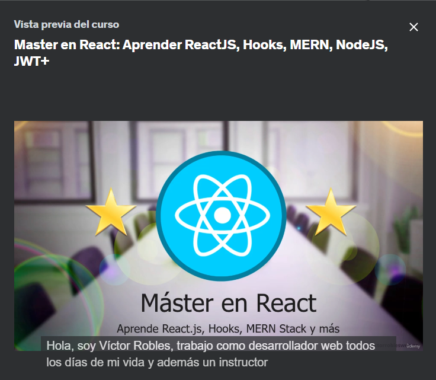

# Master en React: Aprender ReactJS, Hooks, MERN, NodeJS, JWT+
### Aprende React JS con Hooks desde cero y desarrolla aplicaciones web con el MERN Stack (Portafolio, Blog y Red Social)

## Ejercicios de mi Port-folio por PAULA DE JUAN SEGURA

[Master en React: Aprender ReactJS, Hooks, MERN, NodeJS, JWT+ --  https://www.udemy.com/course/master-en-react-aprender-reactjs-hooks-mern-nodejs-jwt/](https://www.udemy.com/course/master-en-react-aprender-reactjs-hooks-mern-nodejs-jwt/)

